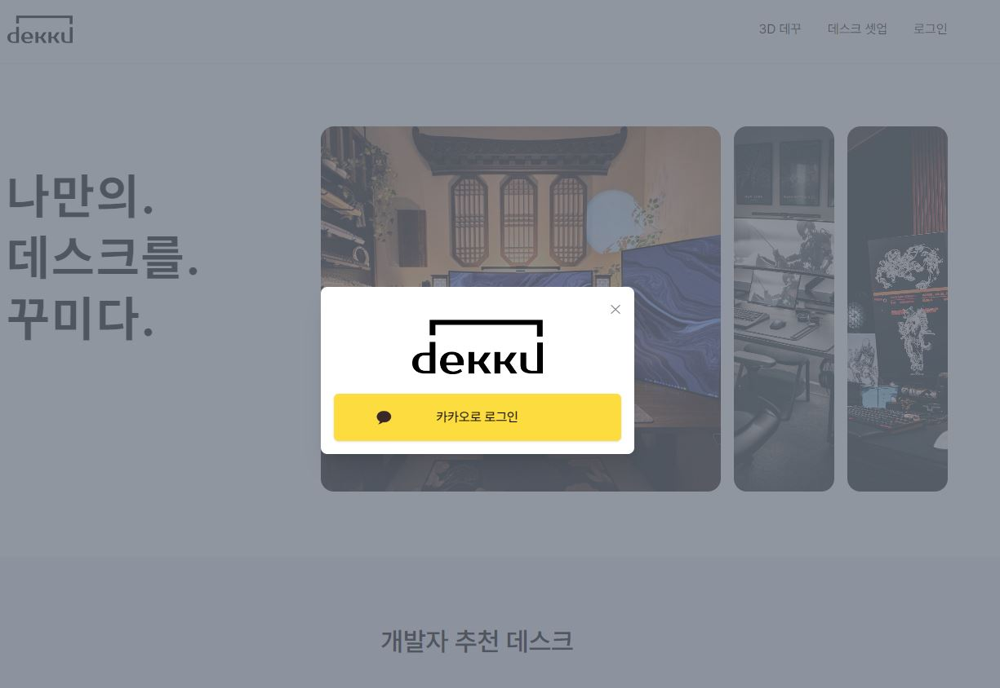
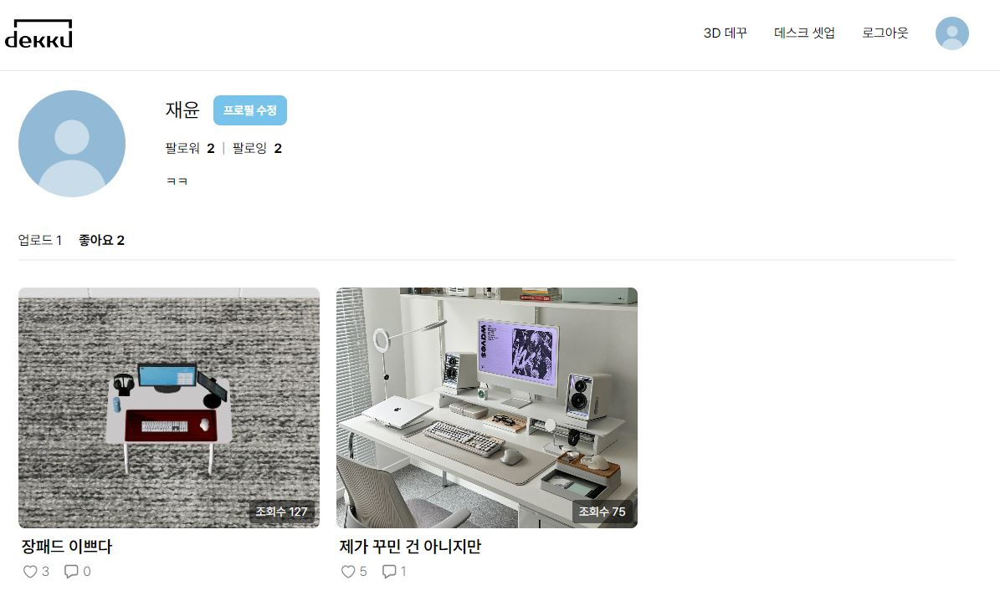
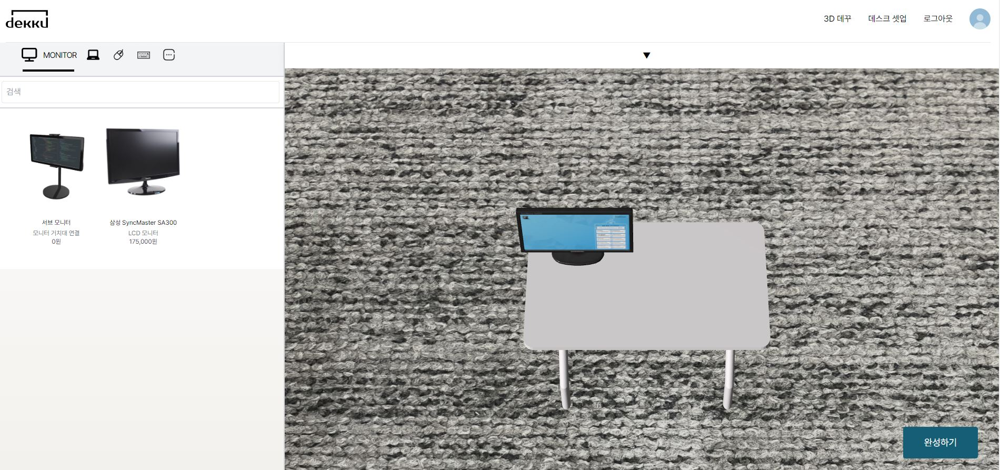
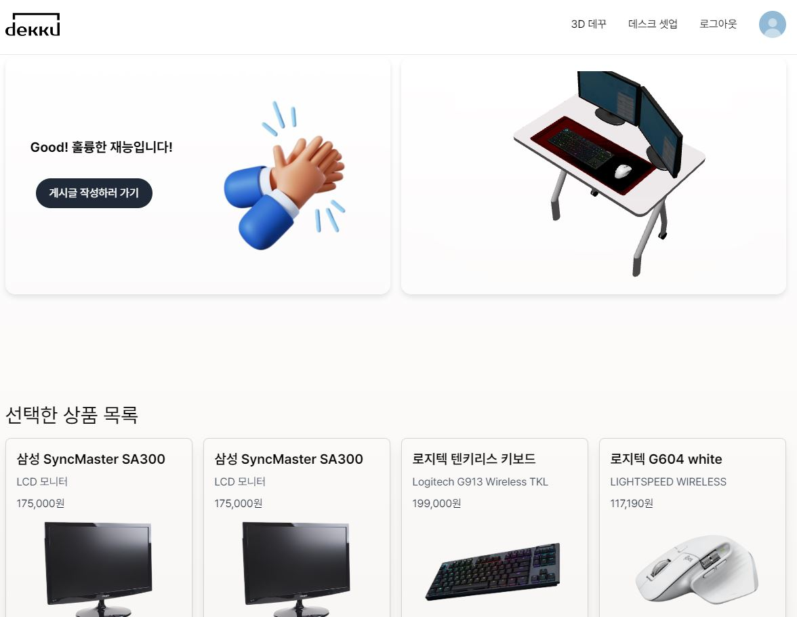
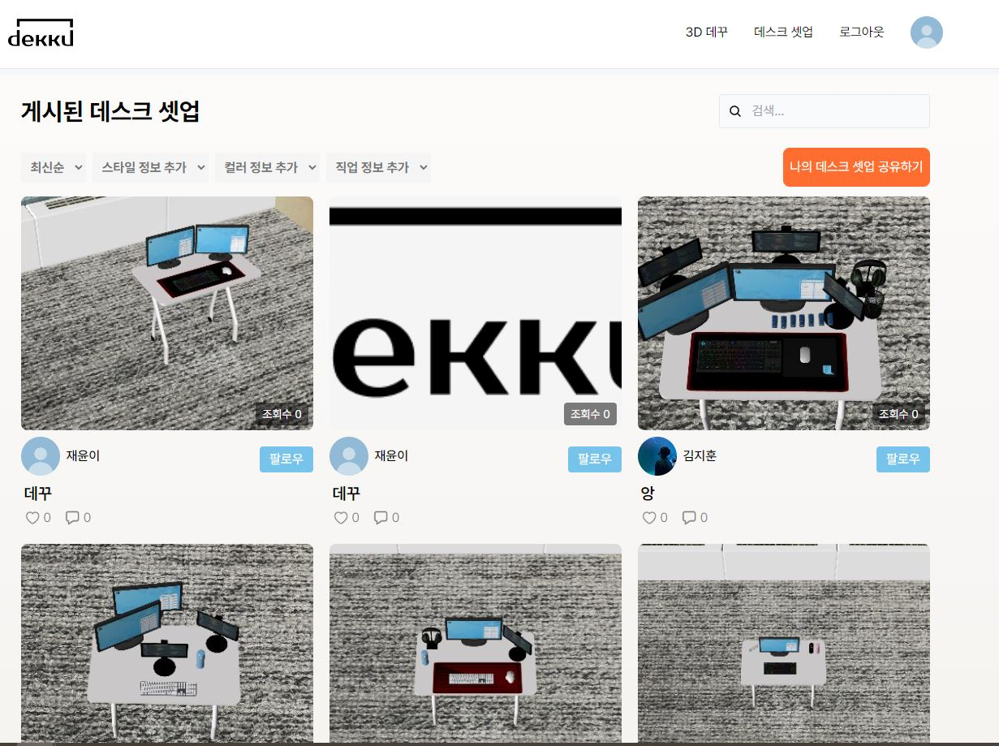
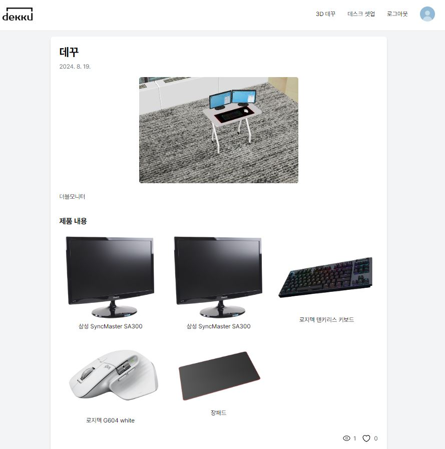
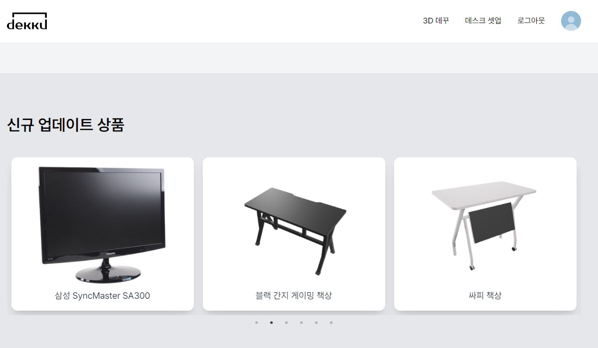
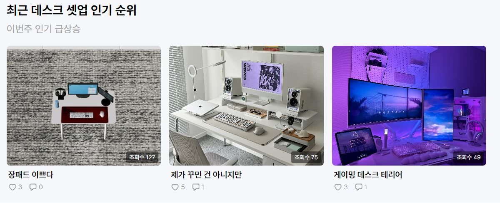
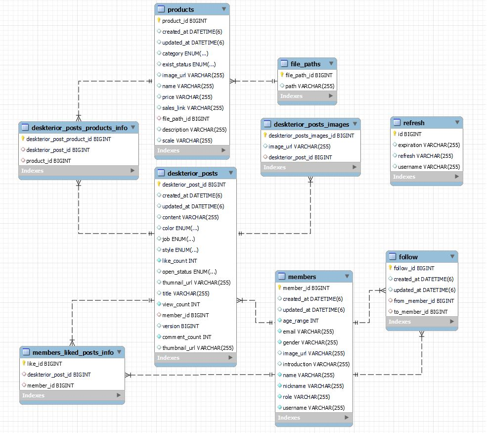

# 🕹️ 나만의 3D 데스크테리어, "dekku"

</br>

## 1. 주제 📌

**3D** 방식의 **데스크 꾸미기 및 공유** 서비스

- ✨ 사용자 3D 공간에서 데스크 꾸미기
- 🌐 나만의 결과물 공유
- 💡 맞춤형 상품 추천

**dekku**는 'desk를 꾸미다'의 약자입니다.  
기존의 상품을 보러 직접 매장을 방문하고고, 정보를 찾기 위해 발품 팔았던 상황을 **온라인에서 한 번에** 해결하자는 취지로 만들어졌습니다.

다른 사람들의 잘 꾸며진 책상을 구경하고, 나만의 결과물을 3D로 만들어 공유해보세요!

## 2. 프로젝트 기간 💬
2024.07.01(월) ~ 2022.08.16(금)   

## 3. 주요 기능 📝

### 3.1. 사용자 관리 📚

- 소셜 로그인(Kakao)으로 간편한 회원가입

- 마이페이지에서 개인 정보 수정 및 내가 작성한 콘텐츠 관리

- 팔로우/팔로워 시스템으로 다른 사용자와의 연결 강화

<div align=center>
  <table border="1" style="border-collapse: collapse; text-align: center; width: 100%;">
    <tr>
      <th scope="col" align=center> 소셜 로그인 </th>
      <th scope="col" align=center> 마이페이지 </th>
    </tr>
    <tr>
      <td align=center>
        
      </td>
      <td align=center>
        
      </td>
    </tr>
  </table>
</div>

### 3.2. 3D 데스크 꾸미기 🖼️

- 다양한 상품(Monitor, Keyboard 등)을 활용해 나만의 데스크를 꾸며보세요

- 화면 회전, 상품 각도 및 높이 조절로 세밀한 커스터마이징 가능

- 꾸민 결과를 360도 회전으로 더 입체적으로 확인

<div align=center>
  <table border="1" style="border-collapse: collapse; text-align: center; width: 100%;">
    <tr>
      <th scope="col" align=center> 3D 작업 </th>
      <th scope="col" align=center> 완료 페이지 </th>
    </tr>
    <tr>
      <td align=center>
        
      </td>
      <td align=center>
        
      </td>
    </tr>
  </table>
</div>

### 3.3. 게시글 작성 및 공유 🖊️

- 꾸민 결과물을 게시글로 작성해 다른 사용자와 공유

- 최신순, 조회순, 스타일별 등 다양한 검색 필터 제공

- 좋아요, 댓글로 사용자 간 소통 강화

<div align=center>
  <table border="1" style="border-collapse: collapse; text-align: center; width: 100%;">
    <tr>
      <th scope="col" align=center> 전체 게시글 </th>
      <th scope="col" align=center> 상세 게시글 </th>
    </tr>
    <tr>
      <td align=center>
        
      </td>
      <td align=center>
        
      </td>
    </tr>
  </table>
</div>

### 3.4. 상품 및 게시글 추천 🛍️

- Dekku한 게시글 속 상품 목록 확인

- 새로운 상품 업데이트 및 인기 게시글 추천 시스템

- 7일마다 갱신되는 추천 리스트로 매번 새로운 콘텐츠 제공

<div align=center>
  <table border="1" style="border-collapse: collapse; text-align: center; width: 100%;">
    <tr>
      <th scope="col" align=center> 상품 추천 </th>
      <th scope="col" align=center> 게시글 추천 </th>
    </tr>
    <tr>
      <td align=center>
        
      </td>
      <td align=center>
        
      </td>
    </tr>
  </table>
</div>

## 4. 사용 기술 ⚒️

**Backend Skills**
* IntelliJ IDEA Ultimate
* Springboot 3.3.2
* Spring Web
* Spring Security
* Spring Data JPA
* Spring Validation
* Swagger 2.0.2
* MySQL
* MongoDB
* Redis
* Redisson

**Frontend Skills**
- Visual Studio Code
- React
- NextJS
- ThreeJs

**CI/CD Skills**
- AWS EC2 Lightsail
- AWS S3
- Jenkins
- NGINX
- Docker

## 5. 팀 구성 🧑🏻

<table border="1" style="border-collapse: collapse; text-align: center; width: 100%;">
    <tr>
      <th scope="col" colspan="4" style="text-align: center; background-color: #ADD8E6; color: #FFF;"> Server </th>
      <th scope="col" colspan="2" style="text-align: center; background-color: #C6ABFF; color: #FFF;"> Client </th>
    </tr>
    <tr>
      <td align="center" style="background-color: #ADD8E6; color: #FFF;">박상후</td>
      <td align="center" style="background-color: #ADD8E6; color: #FFF;">김재윤</td>
      <td align="center" style="background-color: #ADD8E6; color: #FFF;">박지환</td>
      <td align="center" style="background-color: #ADD8E6; color: #FFF;">석준영</td>
      <td align="center" style="background-color: #C6ABFF; color: #FFF;">김민수</td>
      <td align="center" style="background-color: #C6ABFF; color: #FFF;">권주안</td>
    </tr>
    <tr>
      <td>
        <a href="https://github.com/SangHuPark"></a>
      </td>
      <td>
        <a href="https://github.com/Joajy"></a>
      </td>
      <td>
        
      </td>
      <td>
        
      </td>
      <td>
         <a href="https://github.com/min75046591"></a>
      </td>
      <td>
         
      </td>
    </tr>
</table>

## 6. 산출물 📚

|  |  |
| :--: | ---: |
| Architecture |  |
| ERD          |  |

## 7. 프로젝트 파일 구조도 📂

### 7.1. Back-end
<small>

```
📦 spring-dekku
┣ 📂 domain
┃ ┣ 📂 comment
┃ ┃ ┣ 📂 controller
┃ ┃ ┣ 📂 event
┃ ┃ ┣ 📂 exception
┃ ┃ ┣ 📂 model
┃ ┃ ┃ ┣ 📂 dto
┃ ┃ ┃ ┃ ┗ 📂 response
┃ ┃ ┃ ┗ 📂 entity
┃ ┃ ┣ 📂 repository
┃ ┃ ┗ 📂 service
┃ ┣ 📂 deskterior_post
┃ ┃ ┣ 📂 controller
┃ ┃ ┣ 📂 exception
┃ ┃ ┣ 📂 model
┃ ┃ ┃ ┣ 📂 dto
┃ ┃ ┃ ┃ ┣ 📂 request
┃ ┃ ┃ ┃ ┗ 📂 response
┃ ┃ ┃ ┗ 📂 entity
┃ ┃ ┃   ┣ 📂 attribute
┃ ┃ ┃   ┗ 📂 code
┃ ┃ ┣ 📂 repository
┃ ┃ ┗ 📂 service
┃ ┣ 📂 follow
┃ ┃ ┗ 동일한 구조
┃ ┣ 📂 like
┃ ┃ ┗ 동일한 구조
┃ ┣ 📂 member
┃ ┃ ┣ 📂 controller
┃ ┃ ┣ 📂 exception
┃ ┃ ┣ 📂 jwt
┃ ┃ ┣ 📂 model
┃ ┃ ┃ ┣ 📂 dto
┃ ┃ ┃ ┃ ┗ 📂 response
┃ ┃ ┃ ┗ 📂 entity
┃ ┃ ┣ 📂 repository
┃ ┃ ┗ 📂 service
┃ ┃   ┗ 📂 oauth2
┃ ┗ 📂 product
┃   ┣ 📂 controller
┃   ┣ 📂 exception
┃   ┣ 📂 model
┃   ┃ ┣ 📂 dto
┃   ┃ ┃ ┣ 📂 request
┃   ┃ ┃ ┗ 📂 response
┃   ┃ ┗ 📂 entity
┃   ┃   ┗ 📂 code
┃   ┣ 📂 repository
┃   ┗ 📂 service
┣ 📂 global
┃ ┣ 📂 aop
┃ ┣ 📂 config
┃ ┃ ┣ 📂 aws
┃ ┃ ┣ 📂 redis
┃ ┃ ┣ 📂 security
┃ ┃ ┣ 📂 swagger
┃ ┃ ┗ 📂 web
┃ ┣ 📂 exception
┃ ┣ 📂 filter
┃ ┣ 📂 format
┃ ┣ 📂 handler
┃ ┣ 📂 model
┃ ┃ ┣ 📂 dto
┃ ┃ ┗ 📂 entity
┃ ┣ 📂 status
┃ ┗ 📂 util
┗ 📂 infra
  ┗ 📂 aws
    ┣ 📂 controller
    ┣ 📂 model
    ┃ ┗ 📂 dto
    ┃   ┣ 📂 request
    ┃   ┗ 📂 response
    ┗ 📂 service
```
</small>

### 7.2. Front-end
<small>

```
📦 next-dekku
┣ 📂 .idea
┣ 📂 app
┃ ┣ 📂 components
┃ ┃ ┣ 📂 deskSetup
┃ ┃ ┣ 📂 threeD
┃ ┃ ┗ 📂 threeDafter
┃ ┣ 📂 deskSetup
┃ ┃ ┣ 📂 create
┃ ┃ ┣ 📂 create-afterthreed
┃ ┃ ┗ 📂 [id]
┃ ┣ 📂 logout
┃ ┣ 📂 oauth2-jwt-header
┃ ┣ 📂 styles
┃ ┣ 📂 threeD
┃ ┣ 📂 threeDafter
┃ ┗ 📂 users
┃   ┗ 📂 [memberId]
┃     ┗ 📂 edit
┣ 📂 fonts
┗ 📂 public
  ┣ 📂 category
  ┣ 📂 products_image
  ┗ 📂 threedmodels
```
</small>

