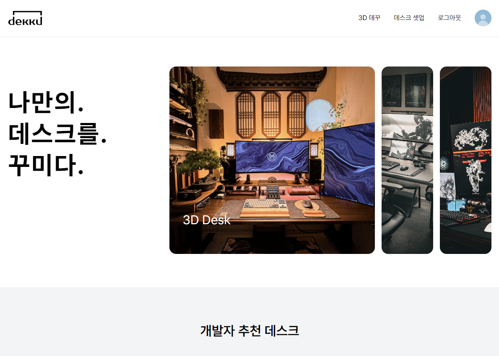

# 📰 Dekku - 나만을 위한 3D 데스크테리어 서비스


</br>

## ❔ Why Dekku?
내 책상이 너무 허전하다? 좀 꾸며보고 싶은데 나가기는 싫고..

그런 당신을 위한 서비스!! 바로 Dekku를 소개합니다!

<span style="color:black">Dekku</span>는 Desk를 꾸미자!의 약자입니다.  
기존 방식대로 상품을 보러 직접 움직이고,
정보를 찾기 위해 발품 팔았던 상황을 온라인에서 한 번에 해결하자는 취지로 만든 웹 서비스입니다.

다른 사람들의 잘 꾸며진 책상도 보고, 내 책상을 3D로 직접 꾸민 결과를 다른 사람들과 공유해봐요!!

## 💬 프로젝트 기간
2024.07.01(월) ~ 2022.08.16(금)   

</br>

🛠️ 메인 기능
---
- ### 회원 관리
    - 번거로운 가입? NO! Kakao 로그인 한 번으로 Dekku의 멤버가 될 수 있어요!
    - 나에 대해 간단한 소개글을 작성할 수 있어요! 팔로워들에게 더 좋은 모습을 어필할 수 있겠죠?
    - 팔로워 및 팔로우 수를 볼 수 있고, 직접 그 사람들의 페이지를 찾아갈 수 있어요!
    - 내가 업로드하거나 좋아요한 Dekku들을 볼 수 있어요! 직접 찾아가는 것보다 훨씬 간편하겠네요!
    - 닉네임을 사용하여 실명이 아니어도 자유롭게 서비스를 이용할 수 있어요!
      <br/>
- ### 3D 데꾸
    - 다양한 상품들로 나만의 책상을 Dekku해봐요!  
      Monitor, Mouse, Keyboard 등 여러 상품들이 있어요
    - 화면을 돌려가며 자유로운 구도를 통해 볼 수 있어요
    - 상품의 각도를 조절하고 싶나요? Dekku는 상품의 각도 및 높이까지 조절할 수 있어요!
    - 내가 선택한 상품들의 정보를 확인할 수 있어요!
    - 완성 결과를 360도 회전하며 내 결과를 더 입체적으로 볼 수 있어요
      <br/>
- ### 데스크 셋업 페이지
    - 나만의 3D 데스크 꾸미기 결과를 모두에게 공유하세요
    - 자유로운 검색을 통해 여러 Dekku를 찾아봐요!  
      검색할 때는 최신순, 조회순, 추천순 외에도 스타일, 컬러, 직업 정보에 따라 다양하게 검색할 수 있어요!
    - Dekku한 게시글의 작성자를 팔로우하고 최신 정보들을 확인하세요!
    - 다른 사람들의 Dekku에 좋아요와 댓글을 남겨보세요
      <br/>
- ### 게시글 추천
    - 좋아요가 많을수록, 게시글 조회수가 많을수록 추천리스트에서 볼 수 있어요!
    - 매 번 똑같은 것만 볼 순 없죠?? 7일마다 갱신되며 새로운 Dekku를 볼 수 있어요!
    - 그러니 매력적인 Dekku를 소개해서 내 글을 다른 사람들에게 선보여볼까요?
      <br/>
- ### 상품 추천
    - Dekku한 게시글에 어떤 상품들이 들어갔는지 확인할 수 있어요
    - 내가 어떤 상품들을 사용할 수 있는지 신규 업데이트된 상품 목록을 볼 수 있어요!
      </br>

✔ 주요 기술
---

**Backend Skills**
* IntelliJ IDEA Ultimate
* Springboot 3.3.2
* Spring Web
* Spring Security
* Spring Data JPA
* Spring Validation
* Swagger 2.0.2
* MySQL
* MongoDB
* Redis
* Redisson

**Frontend Skills**
- Visual Studio Code
- React
- NextJS
- ThreeJs

**CI/CD Skills**
- AWS EC2 Lightsail
- AWS S3
- Jenkins
- NGINX
- Docker

## ERD Diagram


## System Architecture


✔ 프로젝트 파일 구조도
---
### Back
```
spring-dekku
├───domain
│   ├───comment
│   │   ├───controller
│   │   ├───event
│   │   ├───exception
│   │   ├───model
│   │   │   ├───dto
│   │   │   │   └───response
│   │   │   └───entity
│   │   ├───repository
│   │   └───service
│   ├───deskterior_post
│   │   ├───controller
│   │   ├───exception
│   │   ├───model
│   │   │   ├───dto
│   │   │   │   ├───request
│   │   │   │   └───response
│   │   │   └───entity
│   │   │       ├───attribute
│   │   │       └───code
│   │   ├───repository
│   │   └───service
│   ├───follow
│   │   ├───controller
│   │   ├───exception
│   │   ├───model
│   │   │   ├───dto
│   │   │   │   └───response
│   │   │   └───entity
│   │   ├───repository
│   │   └───service
│   ├───like
│   │   ├───controller
│   │   ├───exception
│   │   ├───model
│   │   │   ├───dto
│   │   │   └───entity
│   │   ├───repository
│   │   └───service
│   ├───member
│   │   ├───controller
│   │   ├───exception
│   │   ├───jwt
│   │   ├───model
│   │   │   ├───dto
│   │   │   │   └───response
│   │   │   └───entity
│   │   ├───repository
│   │   └───service
│   │       └───oauth2
│   └───product
│       ├───controller
│       ├───exception
│       ├───model
│       │   ├───dto
│       │   │   ├───request
│       │   │   └───response
│       │   └───entity
│       │       └───code
│       ├───repository
│       └───service
├───global
│   ├───aop
│   ├───config
│   │   ├───aws
│   │   ├───redis
│   │   ├───security
│   │   ├───swagger
│   │   └───web
│   ├───exception
│   ├───filter
│   ├───format
│   ├───handler
│   ├───model
│   │   ├───dto
│   │   └───entity
│   ├───status
│   └───util
└───infra
    └───aws
        ├───controller
        ├───model
        │   └───dto
        │       ├───request
        │       └───response
        └───service
```
### Front
```
next-dekku
├───.idea
├───app
│   ├───components
│   │   ├───deskSetup
│   │   ├───threeD
│   │   └───threeDafter
│   ├───deskSetup
│   │   ├───create
│   │   ├───create-afterthreed
│   │   └───[id]
│   ├───logout
│   ├───oauth2-jwt-header
│   ├───styles
│   ├───threeD
│   ├───threeDafter
│   └───users
│       └───[memberId]
│           └───edit
├───fonts
└───public
    ├───category
    ├───products_image
    └───threedmodels
```


✨ 협업 툴
---
- Git
- JIRA
- Notion
- MatterMost
- SourceTree
- Webex


팀원 소개
---

### Backend
|  |  |  |  |
|:--------------------------------------------------------------------------------------------------------------------------------------------:|:--------------------------------------------------------------------------------------------------------------------------------------------:|:--------------------------------------------------------------------------------------------------------------------------------------------:|:--------------------------------------------------------------------------------------------------------------------------------------------:|
|박상후|김재윤|박지환|석준영|

### Frontend
|  |  |
|:--------------------------------------------------------------------------------------------------------------------------------------------:|:--------------------------------------------------------------------------------------------------------------------------------------------:|
|김민수|권주안|

 Dekku 서비스 장면
---
- ### 회원 관리
  - #### 소셜 로그인(Kakao)
    
  - #### 개인 정보 동의 화면
    
  - #### 로그인 완료 후 페이지
    
  
  - #### 마이페이지
    
    
  - #### 회원 정보 수정
    
    
  - #### 팔로우
    
    
- ### 3D 데꾸
  - #### 3D 데꾸 과정
      
      
      
      
  - #### 게시글 작성
      
      

- ### 데스크 셋업 페이지 
  - #### 전체 게시글
      
  - #### 상세 게시글
      
  - #### 좋아요
      
      
  - #### 댓글
      
      

- ### 상품 및 Dekku 추천 페이지
  - #### 최신 상품 추천 페이지
    
  - #### 데스크 셋업 추천 페이지
    
    